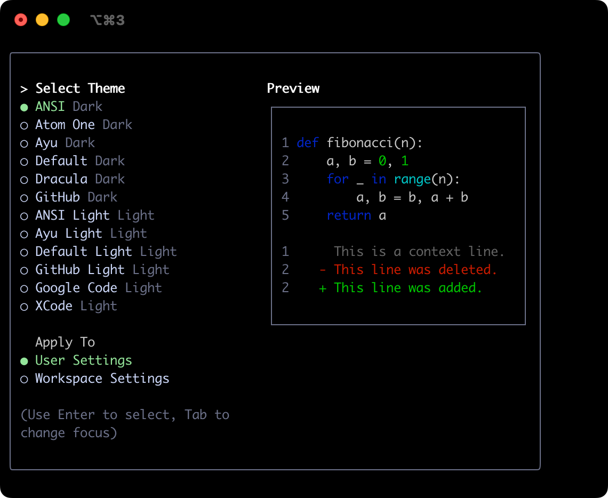
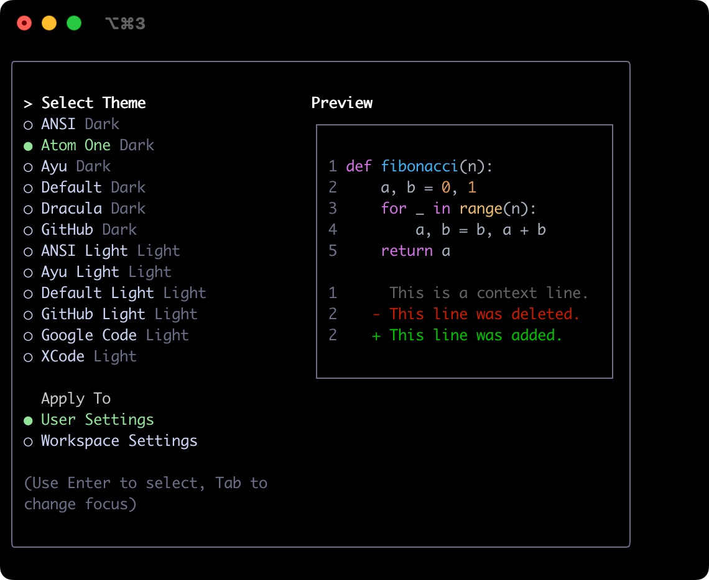
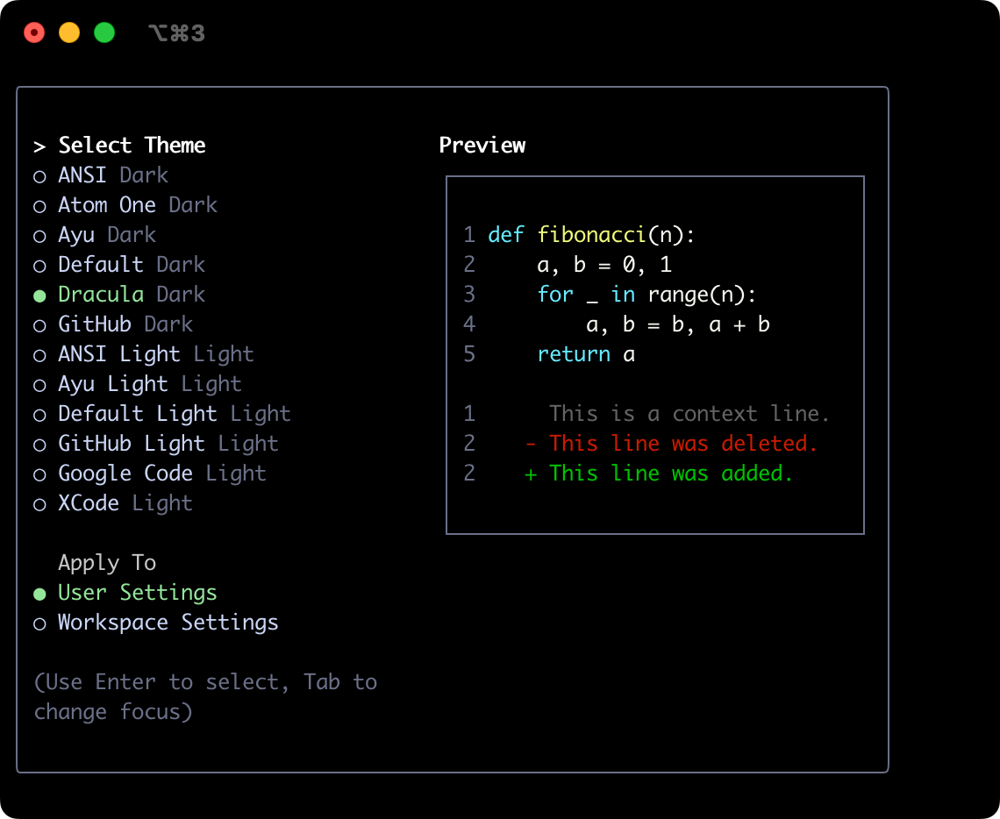
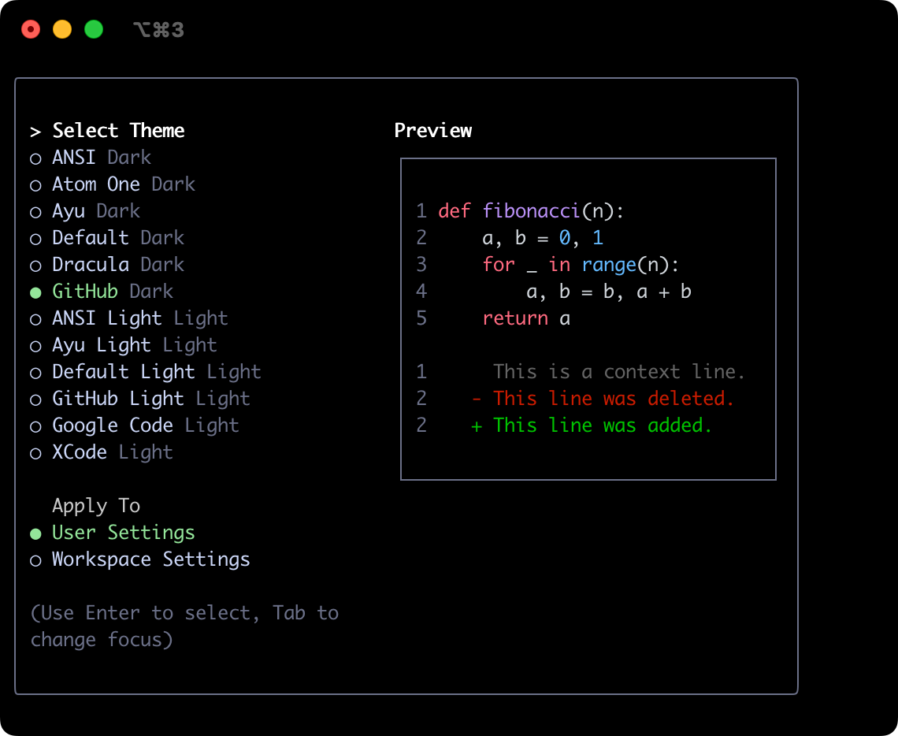
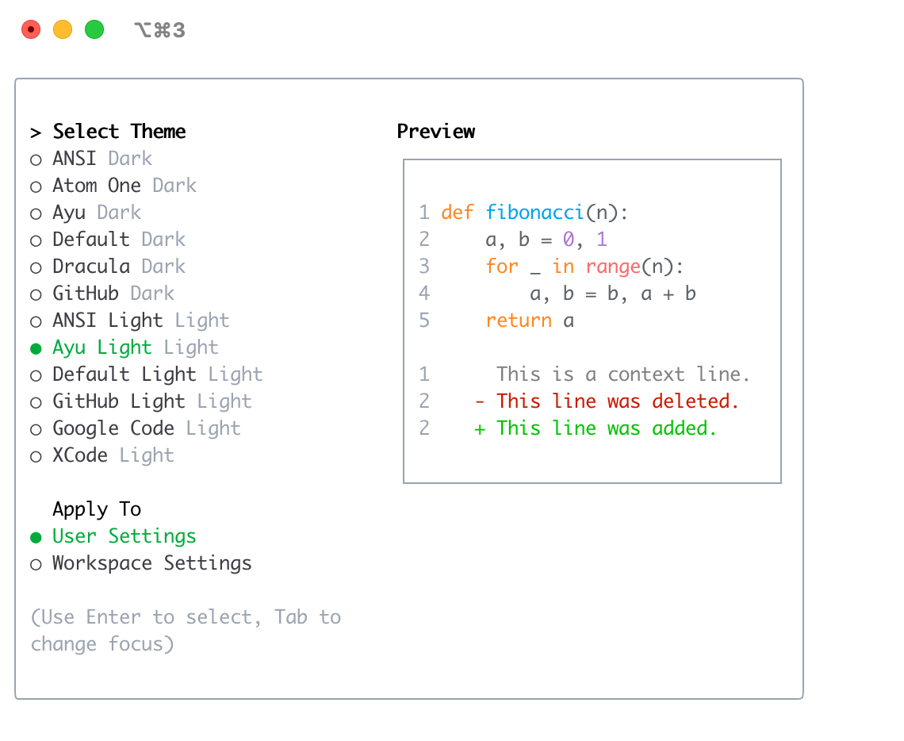
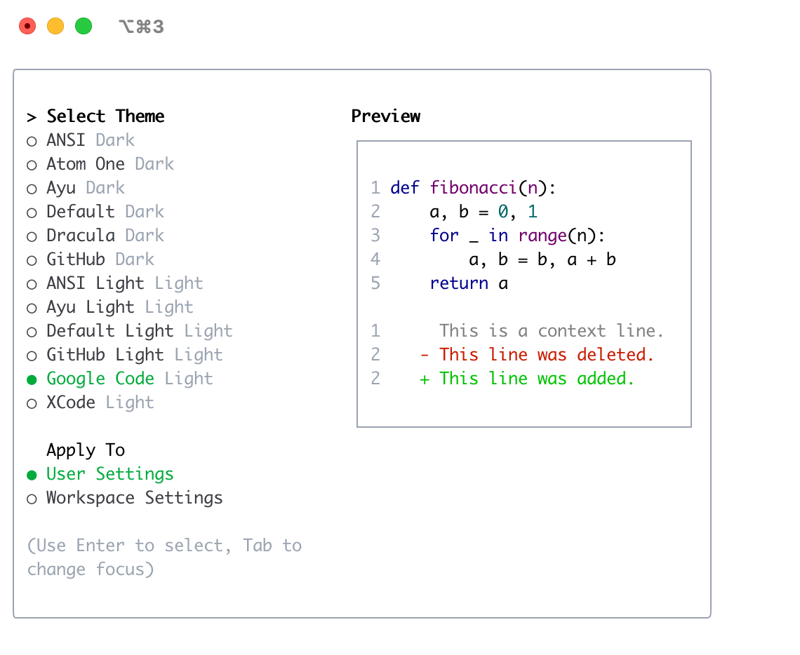

Loaded cached credentials.
# Themes

# 主题

Gemini CLI supports a variety of themes to customize its color scheme and appearance. You can change the theme to suit your preferences via the `/theme` command or `"theme":` configuration setting.

Gemini CLI 支持多种主题以自定义其配色方案和外观。你可以通过 `/theme` 命令或 `"theme":` 配置项来更改主题以满足你的偏好。

## Available Themes

## 可用主题

Gemini CLI comes with a selection of pre-defined themes, which you can list using the `/theme` command within Gemini CLI:

Gemini CLI 内置了一系列预定义主题，你可以通过在 Gemini CLI 中使用 `/theme` 命令来列出它们：

- **Dark Themes:**
  - `ANSI`
  - `Atom One`
  - `Ayu`
  - `Default`
  - `Dracula`
  - `GitHub`

- **深色主题：**
  - `ANSI`
  - `Atom One`
  - `Ayu`
  - `Default`
  - `Dracula`
  - `GitHub`

- **Light Themes:**
  - `ANSI Light`
  - `Ayu Light`
  - `Default Light`
  - `GitHub Light`
  - `Google Code`
  - `Xcode`

- **浅色主题：**
  - `ANSI Light`
  - `Ayu Light`
  - `Default Light`
  - `GitHub Light`
  - `Google Code`
  - `Xcode`

### Changing Themes

### 切换主题

1.  Enter `/theme` into Gemini CLI.
2.  A dialog or selection prompt appears, listing the available themes.
3.  Using the arrow keys, select a theme. Some interfaces might offer a live preview or highlight as you select.
4.  Confirm your selection to apply the theme.

1.  在 Gemini CLI 中输入 `/theme`。
2.  出现一个对话框或选择提示，列出可用的主题。
3.  使用箭头键选择一个主题。某些界面可能会在你选择时提供实时预览或高亮显示。
4.  确认你的选择以应用主题。

### Theme Persistence

### 主题持久化

Selected themes are saved in Gemini CLI's [configuration](./configuration.md) so your preference is remembered across sessions.

所选主题会保存在 Gemini CLI 的[配置](./configuration.md)中，因此你的偏好会在不同会话间被记住。

## Dark Themes

## 深色主题

### ANSI

### ANSI

### Atom OneDark

### Atom OneDark

### Ayu

### Ayu

### Default

### Default

### Dracula

### Dracula

### GitHub

### GitHub

## Light Themes

## 浅色主题

### ANSI Light

### ANSI Light

### Ayu Light

### Ayu Light

### Default Light

### Default Light

### GitHub Light

### GitHub Light

### Google Code

### Google Code

### Xcode

### Xcode

