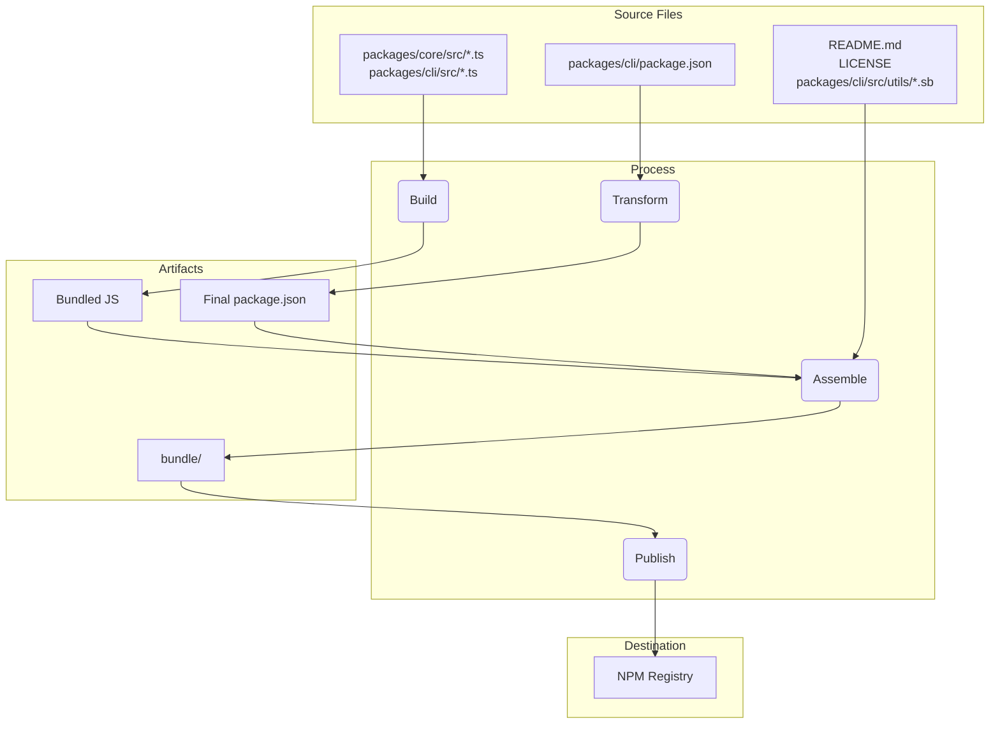
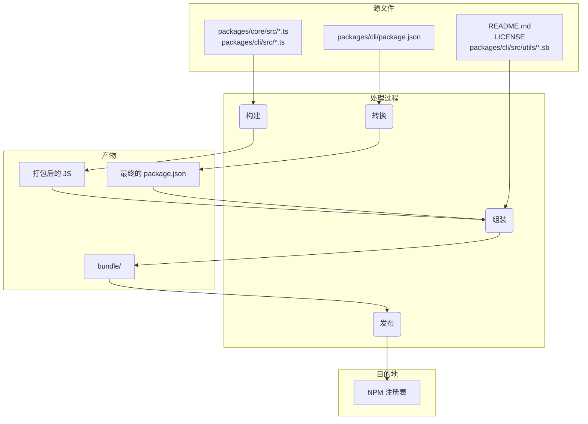

Loaded cached credentials.
# Package Overview

This monorepo contains two main packages: `@google/gemini-cli` and `@google/gemini-cli-core`.

# 软件包概述

这个 monorepo 包含两个主要的软件包：`@google/gemini-cli` 和 `@google/gemini-cli-core`。

## `@google/gemini-cli`

This is the main package for the Gemini CLI. It is responsible for the user interface, command parsing, and all other user-facing functionality.

## `@google/gemini-cli`

这是 Gemini CLI 的主软件包。它负责用户界面、命令解析以及所有其他面向用户的功能。

When this package is published, it is bundled into a single executable file. This bundle includes all of the package's dependencies, including `@google/gemini-cli-core`. This means that whether a user installs the package with `npm install -g @google/gemini-cli` or runs it directly with `npx @google/gemini-cli`, they are using this single, self-contained executable.

当这个软件包发布时，它会被打包成一个单一的可执行文件。这个包包含了该软件包的所有依赖，包括 `@google/gemini-cli-core`。这意味着，无论用户是使用 `npm install -g @google/gemini-cli` 安装该软件包，还是使用 `npx @google/gemini-cli` 直接运行，他们使用的都是这个单一的、自包含的可执行文件。

## `@google/gemini-cli-core`

This package contains the core logic for interacting with the Gemini API. It is responsible for making API requests, handling authentication, and managing the local cache.

## `@google/gemini-cli-core`

这个软件包包含了与 Gemini API 交互的核心逻辑。它负责发起 API 请求、处理身份验证以及管理本地缓存。

This package is not bundled. When it is published, it is published as a standard Node.js package with its own dependencies. This allows it to be used as a standalone package in other projects, if needed. All transpiled js code in the `dist` folder is included in the package.

这个软件包不会被打包。当它发布时，它会作为一个标准的 Node.js 软件包同其自身的依赖一起发布。这使得它可以在需要时作为独立软件包在其他项目中使用。`dist` 文件夹中所有转译后的 js 代码都会被包含在软件包中。

# Release Process

This project follows a structured release process to ensure that all packages are versioned and published correctly. The process is designed to be as automated as possible.

# 发布流程

本项目遵循结构化的发布流程，以确保所有软件包都能被正确地版本化和发布。该流程被设计得尽可能自动化。

## How To Release

Releases are managed through the [release.yml](https://github.com/google-gemini/gemini-cli/actions/workflows/release.yml) GitHub Actions workflow. To perform a manual release for a patch or hotfix:

## 如何发布

发布是通过 [release.yml](https://github.com/google-gemini/gemini-cli/actions/workflows/release.yml) GitHub Actions 工作流来管理的。要为补丁或热修复执行手动发布：

1.  Navigate to the **Actions** tab of the repository.
2.  Select the **Release** workflow from the list.
3.  Click the **Run workflow** dropdown button.
4.  Fill in the required inputs:
    - **Version**: The exact version to release (e.g., `v0.2.1`).
    - **Ref**: The branch or commit SHA to release from (defaults to `main`).
    - **Dry Run**: Leave as `true` to test the workflow without publishing, or set to `false` to perform a live release.
5.  Click **Run workflow**.

1.  导航到仓库的 **Actions** 标签页。
2.  从列表中选择 **Release** 工作流。
3.  点击 **Run workflow** 下拉按钮。
4.  填写所需的输入项：
    - **Version**：要发布的确切版本（例如 `v0.2.1`）。
    - **Ref**：要从此发布的分支或提交 SHA（默认为 `main`）。
    - **Dry Run**：保留为 `true` 以在不发布的情况下测试工作流，或设置为 `false` 以执行实际发布。
5.  点击 **Run workflow**。

## Nightly Releases

In addition to manual releases, this project has an automated nightly release process to provide the latest "bleeding edge" version for testing and development.

## 每夜发布

除了手动发布，本项目还有一个自动化的每夜发布流程，以提供最新的“前沿”版本供测试和开发使用。

### Process

Every night at midnight UTC, the [Release workflow](https://github.com/google-gemini/gemini-cli/actions/workflows/release.yml) runs automatically on a schedule. It performs the following steps:

### 流程

每晚午夜 UTC 时间，[Release workflow](https://github.com/google-gemini/gemini-cli/actions/workflows/release.yml) 会按计划自动运行。它会执行以下步骤：

1.  Checks out the latest code from the `main` branch.
2.  Installs all dependencies.
3.  Runs the full suite of `preflight` checks and integration tests.
4.  If all tests succeed, it calculates the next nightly version number (e.g., `v0.2.1-nightly.20230101`).
5.  It then builds and publishes the packages to npm with the `nightly` dist-tag.
6.  Finally, it creates a GitHub Release for the nightly version.

1.  从 `main` 分支检出最新的代码。
2.  安装所有依赖项。
3.  运行全套的 `preflight` 检查和集成测试。
4.  如果所有测试都成功，它会计算下一个每夜版本的版本号（例如 `v0.2.1-nightly.20230101`）。
5.  然后，它会构建软件包并使用 `nightly` dist-tag 将其发布到 npm。
6.  最后，它会为该每夜版本创建一个 GitHub Release。

### Failure Handling

If any step in the nightly workflow fails, it will automatically create a new issue in the repository with the labels `bug` and `nightly-failure`. The issue will contain a link to the failed workflow run for easy debugging.

### 失败处理

如果每夜工作流中的任何步骤失败，它将自动在仓库中创建一个带有 `bug` 和 `nightly-failure` 标签的新 issue。该 issue 将包含一个指向失败工作流运行的链接，以便于调试。

### How to Use the Nightly Build

To install the latest nightly build, use the `@nightly` tag:

### 如何使用每夜构建版本

要安装最新的每夜构建版本，请使用 `@nightly` 标签：

```bash
npm install -g @google/gemini-cli@nightly
```

```bash
npm install -g @google/gemini-cli@nightly
```

We also run a Google cloud build called [release-docker.yml](../.gcp/release-docker.yaml). Which publishes the sandbox docker to match your release. This will also be moved to GH and combined with the main release file once service account permissions are sorted out.

我们还运行一个名为 [release-docker.yml](../.gcp/release-docker.yaml) 的 Google Cloud Build。它会发布沙盒 Docker 以匹配您的发布版本。一旦服务账户权限问题解决，这个过程也将被迁移到 GH 并与主发布文件合并。

### After the Release

After the workflow has successfully completed, you can monitor its progress in the [GitHub Actions tab](https://github.com/google-gemini/gemini-cli/actions/workflows/release.yml). Once complete, you should:

### 发布之后

工作流成功完成后，您可以在 [GitHub Actions 标签页](https://github.com/google-gemini/gemini-cli/actions/workflows/release.yml) 监控其进度。一旦完成，您应该：

1.  Go to the [pull requests page](https://github.com/google-gemini/gemini-cli/pulls) of the repository.
2.  Create a new pull request from the `release/vX.Y.Z` branch to `main`.
3.  Review the pull request (it should only contain version updates in `package.json` files) and merge it. This keeps the version in `main` up-to-date.

1.  前往仓库的 [pull requests 页面](https://github.com/google-gemini/gemini-cli/pulls)。
2.  从 `release/vX.Y.Z` 分支向 `main` 分支创建一个新的 pull request。
3.  审查该 pull request（它应该只包含 `package.json` 文件中的版本更新）并合并它。这能保持 `main` 分支中的版本为最新。

## Release Validation

After pushing a new release smoke testing should be performed to ensure that the packages are working as expected. This can be done by installing the packages locally and running a set of tests to ensure that they are functioning correctly.

## 发布验证

在推送新版本后，应执行冒烟测试以确保软件包按预期工作。这可以通过在本地安装软件包并运行一组测试来完成，以确保它们功能正常。

- `npx -y @google/gemini-cli@latest --version` to validate the push worked as expected if you were not doing a rc or dev tag
- `npx -y @google/gemini-cli@<release tag> --version` to validate the tag pushed appropriately
- _This is destructive locally_ `npm uninstall @google/gemini-cli && npm uninstall -g @google/gemini-cli && npm cache clean --force &&  npm install @google/gemini-cli@<version>`
- Smoke testing a basic run through of exercising a few llm commands and tools is recommended to ensure that the packages are working as expected. We'll codify this more in the future.

- `npx -y @google/gemini-cli@latest --version` 用于验证推送是否按预期工作（如果您没有使用 rc 或 dev 标签）。
- `npx -y @google/gemini-cli@<release tag> --version` 用于验证标签是否已正确推送。
- _此操作在本地是破坏性的_ `npm uninstall @google/gemini-cli && npm uninstall -g @google/gemini-cli && npm cache clean --force &&  npm install @google/gemini-cli@<version>`
- 建议进行一次基本的冒烟测试，运行几个 llm 命令和工具，以确保软件包按预期工作。我们将来会对此进行更详细的规定。

## When to merge the version change, or not?

The above pattern for creating patch or hotfix releases from current or older commits leaves the repository in the following state:

## 何时合并版本变更，何时不合并？

上述从当前或旧的提交创建补丁或热修复版本的模式会使仓库处于以下状态：

1.  The Tag (`vX.Y.Z-patch.1`): This tag correctly points to the original commit on main
    that contains the stable code you intended to release. This is crucial. Anyone checking
    out this tag gets the exact code that was published.
2.  The Branch (`release-vX.Y.Z-patch.1`): This branch contains one new commit on top of the
    tagged commit. That new commit only contains the version number change in package.json
    (and other related files like package-lock.json).

1.  标签 (`vX.Y.Z-patch.1`)：此标签正确指向 main 分支上包含您打算发布的稳定代码的原始提交。这一点至关重要。任何检出此标签的人都会得到已发布的确切代码。
2.  分支 (`release-vX.Y.Z-patch.1`)：此分支在带标签的提交之上包含一个新的提交。该新提交仅包含 package.json（以及其他相关文件，如 package-lock.json）中的版本号变更。

This separation is good. It keeps your main branch history clean of release-specific
version bumps until you decide to merge them.

这种分离是好的。它使您的 main 分支历史保持干净，免受特定于发布的版本颠簸，直到您决定合并它们。

This is the critical decision, and it depends entirely on the nature of the release.

这是一个关键的决定，完全取决于发布的性质。

### Merge Back for Stable Patches and Hotfixes

You almost always want to merge the `release-<tag>` branch back into `main` for any
stable patch or hotfix release.

### 针对稳定补丁和热修复的合并

对于任何稳定的补丁或热修复版本，您几乎总是希望将 `release-<tag>` 分支合并回 `main`。

- Why? The primary reason is to update the version in main's package.json. If you release
  v1.2.1 from an older commit but never merge the version bump back, your main branch's
  package.json will still say "version": "1.2.0". The next developer who starts work for
  the next feature release (v1.3.0) will be branching from a codebase that has an
  incorrect, older version number. This leads to confusion and requires manual version
  bumping later.
- The Process: After the release-v1.2.1 branch is created and the package is successfully
  published, you should open a pull request to merge release-v1.2.1 into main. This PR
  will contain just one commit: "chore: bump version to v1.2.1". It's a clean, simple
  integration that keeps your main branch in sync with the latest released version.

- 为什么？主要原因是为了更新 main 分支的 package.json 中的版本。如果您从一个旧的提交发布了 v1.2.1，但从未将版本更新合并回去，那么您的 main 分支的 package.json 仍将显示 "version": "1.2.0"。下一个为下一个功能版本（v1.3.0）开始工作的开发人员将从一个版本号不正确、较旧的代码库创建分支。这会导致混淆，并需要在以后手动更新版本。
- 流程：在创建 release-v1.2.1 分支并成功发布软件包后，您应该创建一个 pull request 将 release-v1.2.1 合并到 main。此 PR 将只包含一个提交：“chore: bump version to v1.2.1”。这是一个干净、简单的集成，可让您的 main 分支与最新发布版本保持同步。

### Do NOT Merge Back for Pre-Releases (RC, Beta, Dev)

You typically do not merge release branches for pre-releases back into `main`.

### 不要为预发布版本（RC、Beta、Dev）合并

通常，您不会将预发布版本的发布分支合并回 `main`。

- Why? Pre-release versions (e.g., v1.3.0-rc.1, v1.3.0-rc.2) are, by definition, not
  stable and are temporary. You don't want to pollute your main branch's history with a
  series of version bumps for release candidates. The package.json in main should reflect
  the latest stable release version, not an RC.
- The Process: The release-v1.3.0-rc.1 branch is created, the npm publish --tag rc happens,
  and then... the branch has served its purpose. You can simply delete it. The code for
  the RC is already on main (or a feature branch), so no functional code is lost. The
  release branch was just a temporary vehicle for the version number.

- 为什么？预发布版本（例如 v1.3.0-rc.1、v1.3.0-rc.2）根据定义是不稳定的，并且是临时的。您不希望用一系列发布候选版本的版本更新来污染您的 main 分支的历史记录。main 中的 package.json 应该反映最新的稳定发布版本，而不是 RC 版本。
- 流程：创建 release-v1.3.0-rc.1 分支，执行 npm publish --tag rc，然后……该分支就完成了它的使命。您可以直接删除它。RC 的代码已经存在于 main（或功能分支）上，因此不会丢失任何功能代码。发布分支只是版本号的临时载体。

## Local Testing and Validation: Changes to the Packaging and Publishing Process

If you need to test the release process without actually publishing to NPM or creating a public GitHub release, you can trigger the workflow manually from the GitHub UI.

## 本地测试与验证：打包和发布流程的变更

如果您需要测试发布流程而无需实际发布到 NPM 或创建公共 GitHub release，您可以从 GitHub UI 手动触发工作流。

1.  Go to the [Actions tab](https://github.com/google-gemini/gemini-cli/actions/workflows/release.yml) of the repository.
2.  Click on the "Run workflow" dropdown.
3.  Leave the `dry_run` option checked (`true`).
4.  Click the "Run workflow" button.

1.  前往仓库的 [Actions 标签页](https://github.com/google-gemini/gemini-cli/actions/workflows/release.yml)。
2.  点击 “Run workflow” 下拉菜单。
3.  保持 `dry_run` 选项被选中 (`true`)。
4.  点击 “Run workflow” 按钮。

This will run the entire release process but will skip the `npm publish` and `gh release create` steps. You can inspect the workflow logs to ensure everything is working as expected.

这将运行整个发布流程，但会跳过 `npm publish` 和 `gh release create` 步骤。您可以检查工作流日志以确保一切按预期工作。

It is crucial to test any changes to the packaging and publishing process locally before committing them. This ensures that the packages will be published correctly and that they will work as expected when installed by a user.

在提交对打包和发布流程的任何更改之前，在本地进行测试至关重要。这可以确保软件包能够被正确发布，并且在用户安装后能够按预期工作。

To validate your changes, you can perform a dry run of the publishing process. This will simulate the publishing process without actually publishing the packages to the npm registry.

要验证您的更改，您可以执行发布的试运行（dry run）。这将模拟发布过程，而不会实际将软件包发布到 npm 注册表。

```bash
npm_package_version=9.9.9 SANDBOX_IMAGE_REGISTRY="registry" SANDBOX_IMAGE_NAME="thename" npm run publish:npm --dry-run
```

```bash
npm_package_version=9.9.9 SANDBOX_IMAGE_REGISTRY="registry" SANDBOX_IMAGE_NAME="thename" npm run publish:npm --dry-run
```

This command will do the following:

该命令将执行以下操作：

1.  Build all the packages.
2.  Run all the prepublish scripts.
3.  Create the package tarballs that would be published to npm.
4.  Print a summary of the packages that would be published.

1.  构建所有软件包。
2.  运行所有 prepublish 脚本。
3.  创建将要发布到 npm 的软件包 tarball。
4.  打印将要发布的软件包的摘要。

You can then inspect the generated tarballs to ensure that they contain the correct files and that the `package.json` files have been updated correctly. The tarballs will be created in the root of each package's directory (e.g., `packages/cli/google-gemini-cli-0.1.6.tgz`).

然后，您可以检查生成的 tarball，以确保它们包含正确的文件，并且 `package.json` 文件已正确更新。Tarball 将在每个软件包目录的根目录下创建（例如 `packages/cli/google-gemini-cli-0.1.6.tgz`）。

By performing a dry run, you can be confident that your changes to the packaging process are correct and that the packages will be published successfully.

通过执行试运行，您可以确信您对打包过程的更改是正确的，并且软件包将成功发布。

## Release Deep Dive

The main goal of the release process is to take the source code from the packages/ directory, build it, and assemble a
clean, self-contained package in a temporary `bundle` directory at the root of the project. This `bundle` directory is what
actually gets published to NPM.

## 发布深入解析

发布流程的主要目标是从 packages/ 目录中获取源代码，进行构建，并在项目根目录的一个临时 `bundle` 目录中组装一个
干净、自包含的软件包。这个 `bundle` 目录是最终实际发布到 NPM 的内容。

Here are the key stages:

以下是关键阶段：

Stage 1: Pre-Release Sanity Checks and Versioning

- What happens: Before any files are moved, the process ensures the project is in a good state. This involves running tests,
  linting, and type-checking (npm run preflight). The version number in the root package.json and packages/cli/package.json
  is updated to the new release version.
- Why: This guarantees that only high-quality, working code is released. Versioning is the first step to signify a new
  release.

阶段 1：发布前健全性检查和版本控制

- 发生什么：在移动任何文件之前，流程会确保项目处于良好状态。这包括运行测试、代码检查和类型检查（npm run preflight）。根目录的 package.json 和 packages/cli/package.json 中的版本号会更新为新的发布版本。
- 为什么：这保证了只有高质量、可工作的代码才会被发布。版本控制是标志新发布的第一个步骤。

Stage 2: Building the Source Code

- What happens: The TypeScript source code in packages/core/src and packages/cli/src is compiled into JavaScript.
- File movement:
  - packages/core/src/\*_/_.ts -> compiled to -> packages/core/dist/
  - packages/cli/src/\*_/_.ts -> compiled to -> packages/cli/dist/
- Why: The TypeScript code written during development needs to be converted into plain JavaScript that can be run by
  Node.js. The core package is built first as the cli package depends on it.

阶段 2：构建源代码

- 发生什么：packages/core/src 和 packages/cli/src 中的 TypeScript 源代码被编译成 JavaScript。
- 文件移动：
  - packages/core/src/\*_/_.ts -> 编译到 -> packages/core/dist/
  - packages/cli/src/\*_/_.ts -> 编译到 -> packages/cli/dist/
- 为什么：开发过程中编写的 TypeScript 代码需要被转换成可以由 Node.js 运行的普通 JavaScript。由于 cli 软件包依赖于 core 软件包，因此 core 软件包会首先被构建。

Stage 3: Assembling the Final Publishable Package

This is the most critical stage where files are moved and transformed into their final state for publishing. A temporary
`bundle` folder is created at the project root to house the final package contents.

阶段 3：组装最终可发布的软件包

这是最关键的阶段，文件在此被移动并转换为其最终的发布状态。一个临时的
`bundle` 文件夹会在项目根目录被创建，用于存放最终的软件包内容。

1.  The `package.json` is Transformed:
    - What happens: The package.json from packages/cli/ is read, modified, and written into the root `bundle`/ directory.
    - File movement: packages/cli/package.json -> (in-memory transformation) -> `bundle`/package.json
    - Why: The final package.json must be different from the one used in development. Key changes include:
      - Removing devDependencies.
      - Removing workspace-specific "dependencies": { "@gemini-cli/core": "workspace:\*" } and ensuring the core code is
        bundled directly into the final JavaScript file.
      - Ensuring the bin, main, and files fields point to the correct locations within the final package structure.

1.  转换 `package.json`：
    - 发生什么：从 packages/cli/ 读取 package.json，进行修改，然后写入到根目录的 `bundle`/ 目录中。
    - 文件移动：packages/cli/package.json -> (内存中转换) -> `bundle`/package.json
    - 为什么：最终的 package.json 必须与开发时使用的不同。关键更改包括：
      - 移除 devDependencies。
      - 移除工作区特定的 "dependencies": { "@gemini-cli/core": "workspace:\*" }，并确保核心代码被直接打包到最终的 JavaScript 文件中。
      - 确保 bin、main 和 files 字段指向最终软件包结构中的正确位置。

2.  The JavaScript Bundle is Created:
    - What happens: The built JavaScript from both packages/core/dist and packages/cli/dist are bundled into a single,
      executable JavaScript file.
    - File movement: packages/cli/dist/index.js + packages/core/dist/index.js -> (bundled by esbuild) -> `bundle`/gemini.js (or a
      similar name).
    - Why: This creates a single, optimized file that contains all the necessary application code. It simplifies the package
      by removing the need for the core package to be a separate dependency on NPM, as its code is now included directly.

2.  创建 JavaScript 包：
    - 发生什么：来自 packages/core/dist 和 packages/cli/dist 的已构建 JavaScript 被打包成一个单一的、
      可执行的 JavaScript 文件。
    - 文件移动：packages/cli/dist/index.js + packages/core/dist/index.js -> (由 esbuild 打包) -> `bundle`/gemini.js (或
      类似名称)。
    - 为什么：这会创建一个包含所有必要应用程序代码的、单一的、优化的文件。它简化了软件包，
      因为核心包的代码现在被直接包含进来，不再需要在 NPM 上作为一个独立的依赖项。

3.  Static and Supporting Files are Copied:
    - What happens: Essential files that are not part of the source code but are required for the package to work correctly
      or be well-described are copied into the `bundle` directory.
    - File movement:
      - README.md -> `bundle`/README.md
      - LICENSE -> `bundle`/LICENSE
      - packages/cli/src/utils/\*.sb (sandbox profiles) -> `bundle`/
    - Why:
      - The README.md and LICENSE are standard files that should be included in any NPM package.
      - The sandbox profiles (.sb files) are critical runtime assets required for the CLI's sandboxing feature to
        function. They must be located next to the final executable.

3.  复制静态和支持文件：
    - 发生什么：那些不属于源代码但对于软件包正常工作或良好描述至关重要的文件，
      会被复制到 `bundle` 目录中。
    - 文件移动：
      - README.md -> `bundle`/README.md
      - LICENSE -> `bundle`/LICENSE
      - packages/cli/src/utils/\*.sb (沙盒配置文件) -> `bundle`/
    - 为什么：
      - README.md 和 LICENSE 是任何 NPM 软件包都应包含的标准文件。
      - 沙盒配置文件（.sb 文件）是 CLI 的沙盒功能运行所必需的关键运行时资产。
        它们必须位于最终可执行文件的旁边。

Stage 4: Publishing to NPM

- What happens: The npm publish command is run from inside the root `bundle` directory.
- Why: By running npm publish from within the `bundle` directory, only the files we carefully assembled in Stage 3 are uploaded
  to the NPM registry. This prevents any source code, test files, or development configurations from being accidentally
  published, resulting in a clean and minimal package for users.

阶段 4：发布到 NPM

- 发生什么：npm publish 命令从根目录的 `bundle` 目录内部运行。
- 为什么：通过在 `bundle` 目录内运行 npm publish，只有我们在阶段 3 精心组装的文件才会被上传
  到 NPM 注册表。这可以防止任何源代码、测试文件或开发配置被意外
  发布，从而为用户提供一个干净、最小化的软件包。

Summary of File Flow

文件流程摘要





This process ensures that the final published artifact is a purpose-built, clean, and efficient representation of the
project, rather than a direct copy of the development workspace.

此流程确保最终发布的产物是项目的特制、干净且高效的表示，
而不是开发工作区的直接副本。

## NPM Workspaces

This project uses [NPM Workspaces](https://docs.npmjs.com/cli/v10/using-npm/workspaces) to manage the packages within this monorepo. This simplifies development by allowing us to manage dependencies and run scripts across multiple packages from the root of the project.

## NPM Workspaces

本项目使用 [NPM Workspaces](https://docs.npmjs.com/cli/v10/using-npm/workspaces) 来管理此 monorepo 中的软件包。这通过允许我们从项目根目录管理多个软件包的依赖和运行脚本，从而简化了开发。

### How it Works

The root `package.json` file defines the workspaces for this project:

### 工作原理

根目录的 `package.json` 文件定义了本项目的工作区：

```json
{
  "workspaces": ["packages/*"]
}
```

```json
{
  "workspaces": ["packages/*"]
}
```

This tells NPM that any folder inside the `packages` directory is a separate package that should be managed as part of the workspace.

这告诉 NPM，`packages` 目录内的任何文件夹都是一个独立的软件包，应作为工作区的一部分进行管理。

### Benefits of Workspaces

- **Simplified Dependency Management**: Running `npm install` from the root of the project will install all dependencies for all packages in the workspace and link them together. This means you don't need to run `npm install` in each package's directory.
- **Automatic Linking**: Packages within the workspace can depend on each other. When you run `npm install`, NPM will automatically create symlinks between the packages. This means that when you make changes to one package, the changes are immediately available to other packages that depend on it.
- **Simplified Script Execution**: You can run scripts in any package from the root of the project using the `--workspace` flag. For example, to run the `build` script in the `cli` package, you can run `npm run build --workspace @google/gemini-cli`.

### Workspaces 的好处

- **简化的依赖管理**：从项目根目录运行 `npm install` 将会安装工作区中所有软件包的所有依赖，并将它们链接在一起。这意味着您无需在每个软件包的目录中运行 `npm install`。
- **自动链接**：工作区内的软件包可以相互依赖。当您运行 `npm install` 时，NPM 会自动在软件包之间创建符号链接。这意味着当您对一个软件包进行更改时，这些更改会立即对依赖于它的其他软件包生效。
- **简化的脚本执行**：您可以使用 `--workspace` 标志从项目根目录运行任何软件包中的脚本。例如，要在 `cli` 软件包中运行 `build` 脚本，您可以运行 `npm run build --workspace @google/gemini-cli`。
